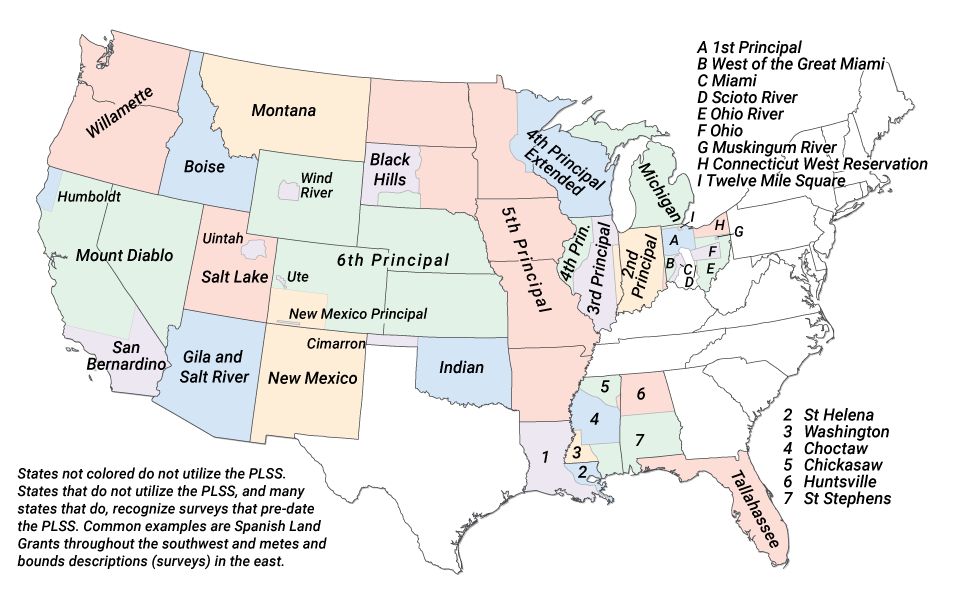
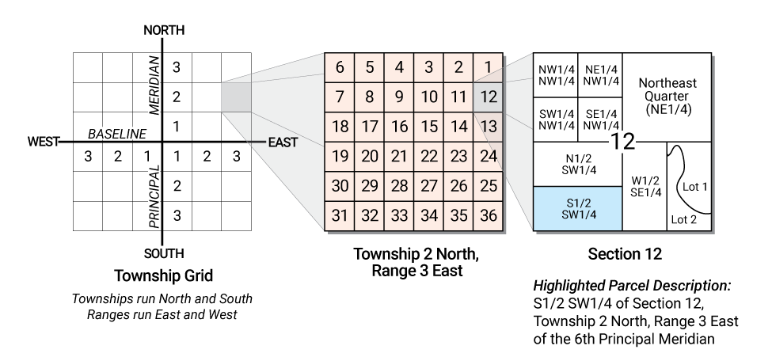
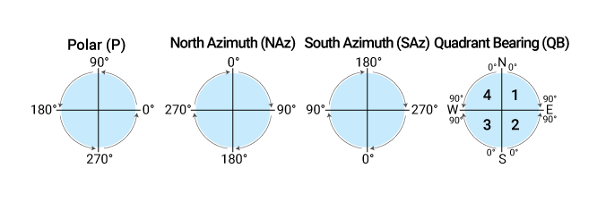
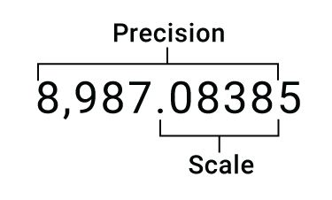

# Table of Contents

- [Geodesy](geodesy/overview.md)
  - [Common Map Scales and Equivalents](geodesy/overview.md#common-map-scales-and-equivalents)
  - [UTM Zones of the World](geodesy/overview.md#utm-zones-of-the-world)
  - [US NAD 1983 State Plane Zones](geodesy/overview.md#us-nad-1983-state-plane-zones)
  - [US NAD 1927 State Plane Zones](geodesy/overview.md#us-nad-1927-state-plane-zones)
- [Scripting](scripting/overview.md)
  - [ArcGIS Scripting Quick Reference](scripting/overview.md#arcgis-scripting-quick-reference)
    - [Math Operators](scripting/overview.md#arcgis-scripting-math-operators)
    - [String Operators](scripting/overview.md#arcgis-scripting-string-operators)
    - [Comparison Operators](scripting/overview.md#arcgis-scripting-comparison-operators)
    - [Logical Operators](scripting/overview.md#arcgis-scripting-logical-operators)
    - [Data Type Conversion Functions](scripting/overview.md#arcgis-scripting-data-type-conversion-functions)
    - [Mathematical Functions](scripting/overview.md#arcgis-scripting-mathematical-functions)
    - [String Functions](scripting/overview.md#arcgis-scripting-string-functions)
    - [Date Functions](scripting/overview.md#arcgis-scripting-date-functions)
- [Common GIS Unit Conversions](#common-gis-unit-conversions)
  - [Common GIS Distance Units](#common-gis-distance-units)
  - [Common GIS Linear Conversions](#common-gis-linear-conversions)
  - [Common GIS Areal Conversions](#common-gis-areal-conversions)
  - [Common Temperature Conversions](#common-temperature-conversions)
  - [Geographic Unit Conversions](#geographic-unit-conversions)
- [U.S. Public Land Survey System (PLSS)](#us-public-land-survey-system-plss)
  - [PLSS Meridians of the conterminous United States](#plss-meridians-of-the-conterminous-united-states)
  - [Township and Section subdivision and numbering in PLSS](#township-and-section-subdivision-and-numbering-in-plss)
- [Esri ArcMap and ArcGIS Pro](#esri-arcmap-and-arcgis-pro)
  - [ArcGIS Direction Systems and Units](#arcgis-direction-systems-and-units)
  - [Common Data Types Supported by ArcGIS](#common-data-types-supported-by-arcgis)
  - [Precision versus Scale versus Length](#arcgis-precision-versus-scale-versus-length)

 - [Coordinate and Projection Systems](#coordinate-and-projection-systems)
   - [UTM Zones of the World](#utm-zones-of-the-world)
 - [Common Map Scales and Equivalents](common-map-scales-and-equivalents.md)

# Common GIS Unit Conversions

### Common GIS Distance Units

| Unit | ArcMap Abbrev | Meters/Unit |
| --- | :---: | :---: |
| Centimeter | cm | 0.01 |
| Chain | ch | 20.1168 |
| Chain, Survey | chUS | 20.1168402337 |
| Foot, International | ft | 0.3048 |
| Foot, US Survey | ftUS | 1200/3937 |
| Inch | in | 0.0254 |
| Kilometer | km | 1000 |
| Link | lk | 0.201168 |
| Link, US Survey | lkUS | 0.2011684023 |
| Meter | m | 1 |
| Mile | mi | 1,609.344 |
| Mile, Nautical | nm | 1,852 |
| Mile, US Survey | miUS | 1,609.3472186944 |
| Millimeter | mm | 0.001 |
| Rod | rd | 5.0292 |
| Rod, US Survey | rdUS | 5.0292100584 |
| Yard | yd | 0.9144 |
| Yard, US Survey | ydUS | 0.9144018288 |

<a href="#table-of-contents">Back to Table of Contents</a>

### Common GIS Linear Conversions

| | |
| --- | :---: |
| 1 inch | 0.0254 meters |
| 1 foot, International | 12 inches |
| 1 foot, International | 0.304801 meters |
| 1 foot, US Survey | 1200/3937 meters |
| 1 yard | 0.9144 meter |
| 1 meter | 39.3701 inches |
| 1 meter | 3.28083 feet |
| 1 fathom | 6 feet |
| 1 fathom | 1.8288 feet |
| 1 rod | 16.5 feet |
| 1 chain | 66 feet |
| 1 chain | 20.1168 meters |
| 1 furlong | 660 feet |
| 1 furlong | 201.168 meters |
| 1 furlong | 40 rods |
| 1 mile | 63,360 inches |
| 1 mile | 5,280 feet |
| 1 mile | 1,609.344 meters |
| 1 mile | 8 furlongs |
| 1 mile, nautical | 1.15077945 miles |
| 1 mile, nautical | 1,852 meters |
| 1 kilometer | 0.621371192 miles |
| 1 kilometer | 3,280.8399 feet |

<a href="#table-of-contents">Back to Table of Contents</a>

### Common GIS Areal Conversions
| | |
| --- | :---: |
| 1 foot2 | 0.092003 meters2 |
| 1 meter2 | 10.76391 feet2 |
| 1 acre | 43,650 feet2 |
| 1 acre | 4,046.856 meters2 |
| 1 acre | 0.404686 hectares |
| 1 acre | 160 rods2 |
| 1 acre | 1/640 mile2 |
| 1 hectare | 107,639.1 feet2 |
| 1 hectare | 10,000 meters2 |
| 1 mile2 | 640 acres |
| 1 mile2 | 2,589,988.11 meters2 |
| 1 mile2 | 27,878,400 feet2 |
| 1 kilometer2 | 247.105381 acres |
| 1 kilometer2 | 10,763,910.4 feet2 |
| 1 kilometer2 | 1,000,000 meters2 |

<a href="#table-of-contents">Back to Table of Contents</a>

### Common Temperature Conversions
| Conversion | Formula |
| --- | :---: |
| Celsius to Farenheit | (5/9)*((&deg;F)-32) |
| Farenheit to Celsius | ((9/5)*(&deg;C))+32

<a href="#table-of-contents">Back to Table of Contents</a>

### Geographic Unit Conversions

Convert to and from degrees-minutes-seconds (DMS) to decimal degrees (DD).

| Deg-Min-Sec | Decimal Degrees |
| :---: | :---: |
| 0&deg; 02' 30" | 0.041667 |
| 0&deg; 05' 00" | 0.083333 |
| 0&deg; 07' 30" | 0.125 |
| 0&deg; 10' 00" | 0.166667 |
| 0&deg; 12' 30" | 0.208333 |
| 0&deg; 15' 00" | 0.25 |
| 0&deg; 17' 30" | 0.291667 |
| 0&deg; 20' 00" | 0.333333 |
| 0&deg; 22' 30" | 0.375 |
| 0&deg; 25' 00" | 0.416667 |
| 0&deg; 27' 30" | 0.458333 |
| 0&deg; 30' 00" | 0.5 |
| 0&deg; 32' 30" | 0.541667 |
| 0&deg; 35' 00" | 0.583333 |
| 0&deg; 37' 30" | 0.625 |
| 0&deg; 40' 00" | 0.666667 |
| 0&deg; 42' 30" | 0.708333 |
| 0&deg; 45' 00" | 0.75 |
| 0&deg; 47' 30" | 0.791667 |
| 0&deg; 50' 00" | 0.833333 |
| 0&deg; 52' 30" | 0.875 |
| 0&deg; 55' 00" | 0.916667 |
| 0&deg; 57' 30" | 0.958333 |

<a href="#table-of-contents">Back to Table of Contents</a>

# US Public Land Survey System (PLSS)

### PLSS Meridians of the conterminous United States

<a href="#table-of-contents">Back to Table of Contents</a>

### Township and Section subdivision and numbering in PLSS

<a href="#table-of-contents">Back to Table of Contents</a>

# Esri ArcMap and ArcGIS Pro

### ArcGIS Direction Systems and Units

ArcGIS Pro and ArcMap support for direction systems for the constructions of features.

In **ArcMap**, to change the direction system and/or units, select **Options** from the **Editor Toolbar**, then 
select the **Units** tab. **ArcGIS Pro** integrates all four directions systems into its native editor by switching to
the abbreviations above.

The supported direction system units include the following: decimal degrees (*default*), degrees-minutes-seconds (DMS), 
radians, gradians, and gons.

[INSERT POLAR/AZIMUTH/QUADRANT BEARING graphic]

<a href="#table-of-contents">Back to Table of Contents</a>

### Common Data Types Supported by ArcGIS

| Data Type | Range | Byte Size | Use |
| :---:     | :---: | :---:     | :--- |
| Short | &plusmn; 32,768 | 2 | To store integer values, typically used for coded values |
| Long | &plusmn; 2.1 billion | 4 | To store integer values, typically used to store quantity values |
| Float | -3.4 to 1.2 x 1038 | 4 | To store single precision (32 bit) floating point numbers, with a scale to 6 decimal places |
| Double | -2.2 to 1.8 x 10308 | 8 | To store double precision (64 bit) floating point numbers, with a scale greater than 6 decimal places |
| Date | varies | varies | To store dates | 
| Text | varies | 1 byte / character | To store character strings. Character encoding varies |
| GUID | n/a | 16 or 38 | To store a globally unique identifier |

<a href="#table-of-contents">Back to Table of Contents</a>

### ArcGIS Precision versus Scale versus Length

<a href="#table-of-contents">Back to Table of Contents</a>

