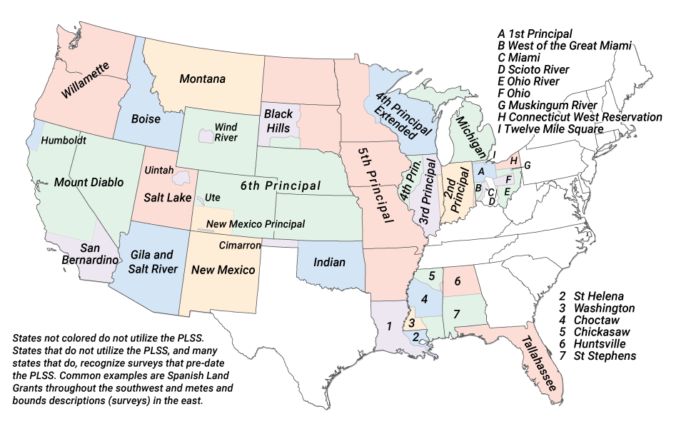
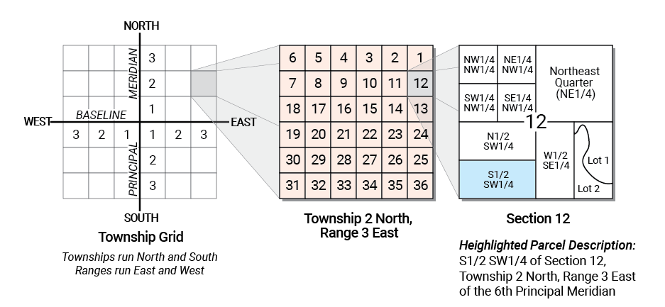
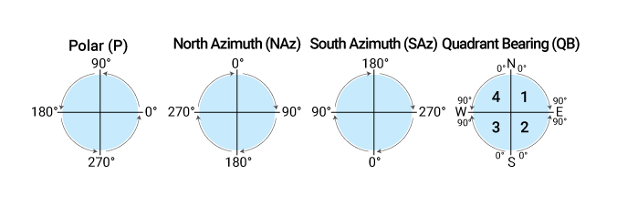
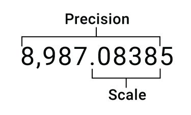

# Table of Contents

- [Common GIS Unit Conversions](#common-gis-unit-conversions)
  - [Common GIS Distance Units](#common-gis-distance-units)
  - [Common GIS Linear Conversions](#common-gis-linear-conversions)
  - [Common GIS Areal Conversions](#common-gis-areal-conversions)
  - [Common Temperature Conversions](#common-temperature-conversions)
  - [Geographic Unit Conversions](#geographic-unit-conversions)
- [U.S. Public Land Survey System (PLSS)](#us-public-land-survey-system-plss)
  - [PLSS Meridians of the conterminous United States](#plss-meridians-of-the-conterminous-united-states)
  - [Township and Section subdivision and numbering in PLSS](#township-and-section-subdivision-and-numbering-in-plss)
- [Esri ArcMap and ArcGIS Pro](#esri-arcmap-and-arcgis-pro)
  - [ArcGIS Direction Systems and Units](#arcgis-direction-systems-and-units)
  - [Common Data Types Supported by ArcGIS](#common-data-types-supported-by-arcgis)
  - [Precision versus Scale versus Length](#arcgis-precision-versus-scale-versus-length)
  - [ArcGIS Scripting Quick Reference](#arcgis-scripting-quick-reference)
    - [Math Operators](#arcgis-scripting-math-operators)
    - [String Operators](#arcgis-scripting-string-operators)
    - [Comparison Operators](#arcgis-scripting-comparison-operators)
    - [Logical Operators](#arcgis-scripting-logical-operators)
    - [Data Type Conversion Functions](#arcgis-scripting-data-type-conversion-functions)
    - [Mathematical Functions](#arcgis-scripting-mathematical-functions)
    - [String Functions](#arcgis-scripting-string-functions)
    - [Date Functions](#arcgis-scripting-date-functions)
 - [Coordinate and Projection Systems](#coordinate-and-projection-systems)
   - [UTM Zones of the World](#utm-zones-of-the-world)
 - [Common Map Scales and Equivalents](#common-map-scales-and-equivalents)

# Common GIS Unit Conversions

### Common GIS Distance Units

| Unit | ArcMap Abbrev | Meters/Unit |
| --- | :---: | :---: |
| Centimeter | cm | 0.01 |
| Chain | ch | 20.1168 |
| Chain, Survey | chUS | 20.1168402337 |
| Foot, International | ft | 0.3048 |
| Foot, US Survey | ftUS | 1200/3937 |
| Inch | in | 0.0254 |
| Kilometer | km | 1000 |
| Link | lk | 0.201168 |
| Link, US Survey | lkUS | 0.2011684023 |
| Meter | m | 1 |
| Mile | mi | 1,609.344 |
| Mile, Nautical | nm | 1,852 |
| Mile, US Survey | miUS | 1,609.3472186944 |
| Millimeter | mm | 0.001 |
| Rod | rd | 5.0292 |
| Rod, US Survey | rdUS | 5.0292100584 |
| Yard | yd | 0.9144 |
| Yard, US Survey | ydUS | 0.9144018288 |

<a href="#table-of-contents">Back to Table of Contents</a>

### Common GIS Linear Conversions

| | |
| --- | :---: |
| 1 inch | 0.0254 meters |
| 1 foot, International | 12 inches |
| 1 foot, International | 0.304801 meters |
| 1 foot, US Survey | 1200/3937 meters |
| 1 yard | 0.9144 meter |
| 1 meter | 39.3701 inches |
| 1 meter | 3.28083 feet |
| 1 fathom | 6 feet |
| 1 fathom | 1.8288 feet |
| 1 rod | 16.5 feet |
| 1 chain | 66 feet |
| 1 chain | 20.1168 meters |
| 1 furlong | 660 feet |
| 1 furlong | 201.168 meters |
| 1 furlong | 40 rods |
| 1 mile | 63,360 inches |
| 1 mile | 5,280 feet |
| 1 mile | 1,609.344 meters |
| 1 mile | 8 furlongs |
| 1 mile, nautical | 1.15077945 miles |
| 1 mile, nautical | 1,852 meters |
| 1 kilometer | 0.621371192 miles |
| 1 kilometer | 3,280.8399 feet |

<a href="#table-of-contents">Back to Table of Contents</a>

### Common GIS Areal Conversions
| | |
| --- | :---: |
| 1 foot2 | 0.092003 meters2 |
| 1 meter2 | 10.76391 feet2 |
| 1 acre | 43,650 feet2 |
| 1 acre | 4,046.856 meters2 |
| 1 acre | 0.404686 hectares |
| 1 acre | 160 rods2 |
| 1 acre | 1/640 mile2 |
| 1 hectare | 107,639.1 feet2 |
| 1 hectare | 10,000 meters2 |
| 1 mile2 | 640 acres |
| 1 mile2 | 2,589,988.11 meters2 |
| 1 mile2 | 27,878,400 feet2 |
| 1 kilometer2 | 247.105381 acres |
| 1 kilometer2 | 10,763,910.4 feet2 |
| 1 kilometer2 | 1,000,000 meters2 |

<a href="#table-of-contents">Back to Table of Contents</a>

### Common Temperature Conversions
| Conversion | Formula |
| --- | :---: |
| Celsius to Farenheit | (5/9)*((&deg;F)-32) |
| Farenheit to Celsius | ((9/5)*(&deg;C))+32

<a href="#table-of-contents">Back to Table of Contents</a>

### Geographic Unit Conversions

Convert to and from degrees-minutes-seconds (DMS) to decimal degrees (DD).

| Deg-Min-Sec | Decimal Degrees |
| :---: | :---: |
| 0&deg; 02' 30" | 0.041667 |
| 0&deg; 05' 00" | 0.083333 |
| 0&deg; 07' 30" | 0.125 |
| 0&deg; 10' 00" | 0.166667 |
| 0&deg; 12' 30" | 0.208333 |
| 0&deg; 15' 00" | 0.25 |
| 0&deg; 17' 30" | 0.291667 |
| 0&deg; 20' 00" | 0.333333 |
| 0&deg; 22' 30" | 0.375 |
| 0&deg; 25' 00" | 0.416667 |
| 0&deg; 27' 30" | 0.458333 |
| 0&deg; 30' 00" | 0.5 |
| 0&deg; 32' 30" | 0.541667 |
| 0&deg; 35' 00" | 0.583333 |
| 0&deg; 37' 30" | 0.625 |
| 0&deg; 40' 00" | 0.666667 |
| 0&deg; 42' 30" | 0.708333 |
| 0&deg; 45' 00" | 0.75 |
| 0&deg; 47' 30" | 0.791667 |
| 0&deg; 50' 00" | 0.833333 |
| 0&deg; 52' 30" | 0.875 |
| 0&deg; 55' 00" | 0.916667 |
| 0&deg; 57' 30" | 0.958333 |

<a href="#table-of-contents">Back to Table of Contents</a>

# US Public Land Survey System (PLSS)

### PLSS Meridians of the conterminous United States

<a href="#table-of-contents">Back to Table of Contents</a>

### Township and Section subdivision and numbering in PLSS

<a href="#table-of-contents">Back to Table of Contents</a>

# Esri ArcMap and ArcGIS Pro

### ArcGIS Direction Systems and Units

ArcGIS Pro and ArcMap support for direction systems for the constructions of features.

In **ArcMap**, to change the direction system and/or units, select **Options** from the **Editor Toolbar**, then 
select the **Units** tab. **ArcGIS Pro** integrates all four directions systems into its native editor by switching to
the abbreviations above.

The supported direction system units include the following: decimal degrees (*default*), degrees-minutes-seconds (DMS), 
radians, gradians, and gons.

[INSERT POLAR/AZIMUTH/QUADRANT BEARING graphic]

<a href="#table-of-contents">Back to Table of Contents</a>

### Common Data Types Supported by ArcGIS

| Data Type | Range | Byte Size | Use |
| :---:     | :---: | :---:     | :--- |
| Short | &plusmn; 32,768 | 2 | To store integer values, typically used for coded values |
| Long | &plusmn; 2.1 billion | 4 | To store integer values, typically used to store quantity values |
| Float | -3.4 to 1.2 x 1038 | 4 | To store single precision (32 bit) floating point numbers, with a scale to 6 decimal places |
| Double | -2.2 to 1.8 x 10308 | 8 | To store double precision (64 bit) floating point numbers, with a scale greater than 6 decimal places |
| Date | varies | varies | To store dates | 
| Text | varies | 1 byte / character | To store character strings. Character encoding varies |
| GUID | n/a | 16 or 38 | To store a globally unique identifier |

<a href="#table-of-contents">Back to Table of Contents</a>

### ArcGIS Precision versus Scale versus Length

<a href="#table-of-contents">Back to Table of Contents</a>

### ArcGIS Scripting Quick Reference

#### ArcGIS Scripting Math Operators

| Operator | Description | Arcade | Python | VBScript | 
| --- | --- | :---: | :---: | :---: | 
| Integer Division | Returns the integer of `x` divided by `y` | `Floor(x / y)` | `x // y` | `x \ y` |
| Modulus | Returns the remainder of `x` divided by `y` | `x % y` | `x % y` | `x mod y` |
| Exponent | Returns the values `x` raised to the power of `y` | `x ** y` | `x ** y` | `x ^ y` |

<a href="#table-of-contents">Back to Table of Contents</a>

#### ArcGIS Scripting String Operators

| Operator | Description | Arcade | Python | VBScript | 
| --- | --- | :---: | :---: | :---: | 
| Concatenation | Concatenates string `a` with string `b` | `a + b` | `a + b` | `a & b` |
| CR/LF | Adds a carriage return and line feed to a string | `\n` | `\r\n` | `vbCRLF` |
| Line Feed | Adds a line feed to a string | `\n` | `\n` | `vbNewLine` |

<a href="#table-of-contents">Back to Table of Contents</a>

#### ArcGIS Scripting Comparison Operators

| Operator | Description | Arcade | Python | VBScript | 
| --- | --- | :---: | :---: | :---: | 
| Equal to | If `x` is equal to `y` returns `true` else `false` | `x == y` | `x == y` | `x = y` | 
| Not Equal to | If `x` is not equal to `y` returns `true` else `false` | `x != y` | `x != y` | `x <> y` |
| Greater than | If `x` is greater than `y` returns `true` else `false` | `x > y` | `x > y` | `x > y` | 
| Less than | If `x` is less than `y` returns `true` else `false` | `x > y` | `x > y` | `x > y` | 
| Greater than or equal to | If `x` is greater than or equal to `y` returns `true` else `false` | `x > y` | `x > y` | `x > y` | 
| Less than or equal to | If `x` is less than or equal to `y` returns `true` else `false` | `x > y` | `x > y` | `x > y` | 

<a href="#table-of-contents">Back to Table of Contents</a>

#### ArcGIS Scripting Logical Operators

| Operator | Description | Arcade | Python | VBScript | 
| --- | --- | :---: | :---: | :---: | 
| or | Returns `true` if one of the two values returns `true` | <code>a &#124;&#124; b</code> | `a or b` | `a Or b` |
| and | Returns `true` if both given values return `true` | `a && b` | `a and b` | `a And b` |
| not | Returns `true` the values do not return `true` | <code>a &#124; b</code> | `a not b` | `a Not b` |

<a href="#table-of-contents">Back to Table of Contents</a>

#### ArcGIS Scripting Data Type Conversion Functions

| Data Type | Description | Arcade | Python | VBScript | 
| --- | --- | :---: | :---: | :---: | 
| Date | Returns a `date` data type | `Date()` | `datetime.strptime()` | `CDate()` |
| Double | Returns a `double` data type | `Number()` | `float()` | `CDbl()` |
| Integer | Returns an `integer` data type | `Number()` | `int()` | `CInt()` |
| String | Returns a `string` data type | `Text()` | `str()` | `CStr()` |

<a href="#table-of-contents">Back to Table of Contents</a>

#### ArcGIS Scripting Mathematical Functions

| Function | Description | Arcade | Python | VBScript | 
| --- | --- | :---: | :---: | :---: | 
| Absolute | Returns the absolute value of a given value (`n`) | `Abs(n)` | `abs(n)` | `Abs(n)` |
| Average | Returns the average of an array of numbers (`[n]`) | `Average([n])` | `sum([n])/len([n])` | - |
| Ceiling | Returns the value (`n`) rounded up to the nearest integer | `Ceil(n)` | `math.ceil(n)` | `Int(n) + 1` |
| Constrain | Constrains value (`x`) to minimum (`i`) and maximum (`j`) bounds | `Constrain(x,i,j)` | `min(j,max(i, x)` | - |
| Exponent | Returns the base of a natural logarithm raised to a power (`x`) | `Exp(x)` | `math.exp(x)` | `Exp(x)` | 
| Floor | Returns the value (`n`) rounded down to the nearest integer | `Floor(n)` | `math.floor(n)` | `Int(n)` |
| Maximum | Returns the highest value from an array of numbers (`[n]`) | `Max([n])` | `max([n])` | - |
| Mean | Returns the mean value of an array of numbers (`[n]`) | `Mean([n])` | `statistics.mean([n])` | - |
| Minimum | Returns the lowest value from an array of numbers (`[n]`) | `Max([n])` | `max([n])` | - |
| Random | Returns a random number | `Random()` | `random.random()` | `Rnd` |
| Round | Returns the value (`n`) rounded to a given decimal place (`i`) | `Round(n,i)` | `round(n,i)` | `Round(n,i)` |
| Square Root | Returns the square root of a number (`n`) | `Sqrt(n)` | `math.sqrt(n)` | `Sqr(n)` |
| Sum | Returns the sum of an array of numbers (`[n]`) | `Sum([n])` | `sum([n])` | - |

<a href="#table-of-contents">Back to Table of Contents</a>

#### ArcGIS Scripting String Functions

| Function | Description | Arcade | Python | VBScript | 
| --- | --- | :---: | :---: | :---: | 
| Concatenate | Concatenates an array of strings together | `Concatenate()` | `.join()` | `&` |
| Find | Find position of a string (`a`) in string (`b`) | `Find(a, b)` | `b.find(a)` | `InStr(b, a)` |
| Left | Return (`n`) characters from the beginning of a string (`a`) | `Left(a, n)` | `a[:n]` | `Left(a, n)` |
| Length | Returns the character length of a string (`a`) | `Count(a)` | `len(a)` | `Len(a)` |
| Lowercase | Converts text (`a`) to all lower case characters | `Lower(a)` | `a.lower()` | `LCase(a)` |
| Mid | Returns (`j`) characters from string (`a`) starting a position (`i`) | `Mid(a, i, j)` | `a[i:i+j]` | `Mid(a, i, j)` |
| Replace | Replace string (`a`) with string (`b`) within string (`x`) | `Replace(x, a, b)` | `x.replace(a, b)` | `Replace(x, a, b)` |
| Right | Return (`n`) characters from the end of a string (`a`) | `Right(a, n)` | `a[-n:]` | `Right(a, n)` |
| Split | Splits text (`a`) into an array on separator (`x`) | `Split(x, a)` | `x.split(a)` | `Split(x, a)` |
| Titlecase | Converts text (`a`) to title or proper case | `Proper(a)` | `a.title()` | - |
| Trim | Removes spaces from the beginning and end of a string (`a`) | `Trim(a)` | `a.strip()` | `Trim(a)` |
| Uppercase | Converts text (`a`) to upper case characters | `Upper(a)` | `a.upper()` | `UCase(a)` |

<a href="#table-of-contents">Back to Table of Contents</a>

#### ArcGIS Scripting Date Functions

| Function | Description | Arcade | Python | VBScript | 
| --- | --- | :---: | :---: | :---: | 
| Date Addition | Adds value (`v`) in units (`u`) to the date (`d`) | `DateAdd(d, v, u)` | `d + timedelta(v=u)` | `DateAdd(v, u, d)` |
| Date Difference | Returns the intervals (`i`) between dates `d1` & `d2` | `DateDiff(d1, d2, i)` | - | `DateDiff(i, d1, d2)` |
| Now | Returns the current date and time in local time | `Now()` | `datetime.now()` | `Now()` |
| Timestamp | Returns the current date and time in UTC time | `Timestamp()` | `datetime.utcnow()` | - |
| Today | Returns the current date in local time | `Today()` | `datetime.today()` | `Date()` |

<a href="#table-of-contents">Back to Table of Contents</a>

# Coordinate and Projection Systems

### UTM Zones of the World

    <iframe src="https://developers.arcgis.com/javascript/latest/sample-code/layers-geojson/live/index.html"></iframe>

# Common Map Scales and Equivalents

| Map Scale | Architectual/ Engineering Scale | Visual Scale | Example map scale (areas to represent) |
| :---: | :---: | :---: | --- |
|          1:71 | 1 in ~ 6 ft 1 cm ~ 0.71 m       | Really?      | Web Map Zoom Level 23 |
|         1:141 | 1 in ~ 12 ft 1 cm ~ 1.41 m      |              | Web Map Zoom Level 22 |
|         1:282 | 1 in ~ 24 ft 1 cm ~ 2.82 m      | &uarr;       | Web Map Zoom Level 21 |
|         1:564 | 1 in = 47 ft 1 cm = 5.64 m      | Large Scale  | Web Map Zoom Level 20 (a mid-sized building) |
|       1:1,000 | 1 in ~ 83 ft 1 cm = 10 m        | &uarr;       |  |
|       1:1,128 | 1 in = 94 ft 1 cm ~ 11 m        |              | Web Map Zoom Level 19 (a road and crossing details) |
|       1:1,200 | 1 in = 100 ft 1 cm = 12 m       |              | US Site Plans & Plan and Profiles |
|       1:2,257 | 1 in ~ 188 ft 1 cm ~ 23 m       |              | Web Map Zoom Level 18 (a group of buildings) |
|       1:2,400 | 1 in = 200 ft 1 cm = 24 m       |              | Parcel Data |
|       1:4,514 | 1 in ~ 376 ft 1 cm ~ 45 m       |              | Web Map Zoom Level 17 (a block, park, or range of addresses) |
|       1:5,000 | 1 in ~ 417 ft 1 cm = 50 m       |              |  |
|       1:6,000 | 1 in = 500 ft 1 cm = 60 m       |              | Parcel Data |
|       1:9,028 | 1 in ~ 752 ft 1 cm ~ 90 m       |              | Web Map Zoom Level 16 (a street) |
|      1:10,000 | 1 in ~ 833 ft 1 cm = 100 m      | &darr;       |  |
|      1:12,000 | 1 in = 1,000 ft 1 cm = 120 m    | Large Scale  |  |
|      1:18,056 | 1 in ~ 1,505 ft 1 cm ~ 181 m    | &uarr;              | Web Map Zoom Level 15 (a rural road) |
|      1:24,000 | 1 in = 2,000 ft 1 cm = 240 m    |              | Used in USGS 7.5-minute topographic maps |
|      1:25,000 | 1 in ~ 2,083 ft 1 cm = 250 m    |              | Commonly used in many Canadian, European, US Military and USGS 7.5 x 15-minute topographic maps |
|      1:31,680 | 1 in = 0.5 mi 1 cm ~ 317 m      |              |  |
|      1:36,112 | 1 in ~ 0.57 mi 1 cm ~ 361 m     | &darr;       | Web Map Zoom Level 14 |
|      1:50,000 | 1 in ~ 0.79 mi 1 cm = 0.5 km    | Medium Scale | Commonly used in Canadian, European, US Military, and USGS County maps |
|      1:62,500 | 1 in ~ 0.99 mi 1 cm = 625 m     | &uarr;              | Used in USGS 15-minute topographic maps |
|      1:63,600 | 1 in = 1 mi 1 cm = 636 m        |              | Used in USGS 15-minnute Alaska series topographic maps |
|      1:72,224 | 1 in ~ 1.14 mi 1 cm ~ 722 m     |              | Web Map Zoom Level 13 (a village or suburb) |
|     1:100,000 | 1 in ~ 1.58 mi 1 cm = 1 km      |              | USGS & BLM 30 x 60-minute & USGS County maps |
|     1:144,448 | 1 in ~ 2.28 mi 1 cm = 1.44 km   | &darr;       | Web Map Zoom Level 12 (a town or city district) |
|     1:250,000 | 1 in ~ 3.95 mi 1 cm = 2.5 km    | Small Scale  | USGS 1 x 2-degree topographic maps |
|     1:288,895 | 1 in ~ 4.56 mi 1 cm ~ 2.89 km   | &uarr;       | Web Map Zoom Level 11 (a city) |
|     1:500,000 | 1 in ~ 7.89 mi 1 cm = 5 km      |              | USGS State Maps |
|     1:577,791 | 1 in ~ 9.12 mi 1 cm ~ 5.78 km   |              | Web Map Zoom Level 10 (a metropolitan area)|
|   1:1,000,000 | 1 in ~ 15.78 mi 1 cm = 10 km    |              | USGS State Maps |
|   1:1,155,581 | 1 in ~ 18.24 mi 1 cm ~ 11.56 km |              | Web Map Zoom Level 9 (a wide area or large metropolitan area) |
|   1:2,311,162 | 1 in ~ 36.48 mi 1 cm ~ 23.11 km |              | Web Map Zoom Level 8 |
|   1:4,622,325 | 1 in ~ 72.95 mi 1 cm ~ 46.22 km |              | Web Map Zoom Level 7 (a small country or US state) |
|   1:9,244,649 | 1 in ~ 146 mi 1 cm ~ 92 km      |              | Web Map Zoom Level 6 (a large European country)  |
|  1:18,489,298 | 1 in ~ 291 mi 1 cm ~ 185 km     |              | Web Map Zoom Level 5 (a large African country) |
|  1:36,978,597 | 1 in ~ 584 mi 1 cm ~ 370 km     |              | Web Map Zoom Level 4 (the United States) |
|  1:73,957,194 | 1 in ~ 1,167 mi 1 cm ~ 740 km   |              | Web Map Zoom Level 3 (the largest countries) |
| 1:147,914,388 | 1 in ~ 2,335 mi 1 cm ~ 1,479 km |              | Web Map Zoom Level 2 (a subcontinental area) |
| 1:295,828,755 | 1 in ~ 4,669 mi 1 cm ~ 2,958 km | &darr;       | Web Map Zoom Level 1 |
| 1:591,657,551 | 1 in ~ 9,338 mi 1 cm ~ 5,917 km | Small Scale  | Web Map Zoom Level 0 (the whole world)|  

<a href="#table-of-contents">Back to Table of Contents</a>

