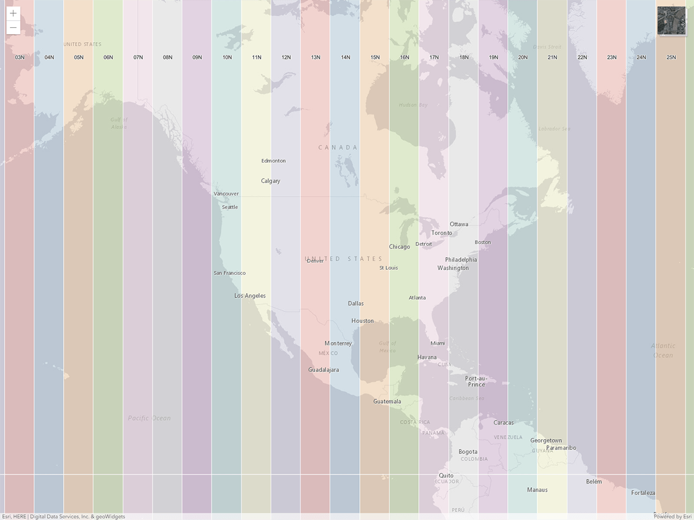
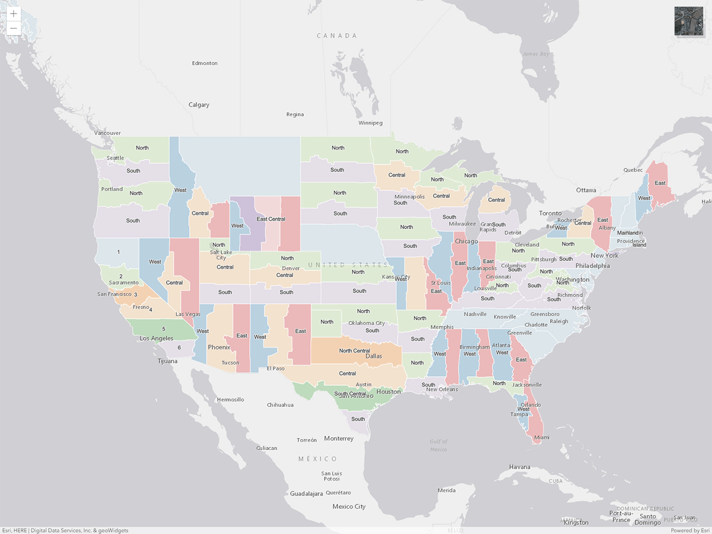
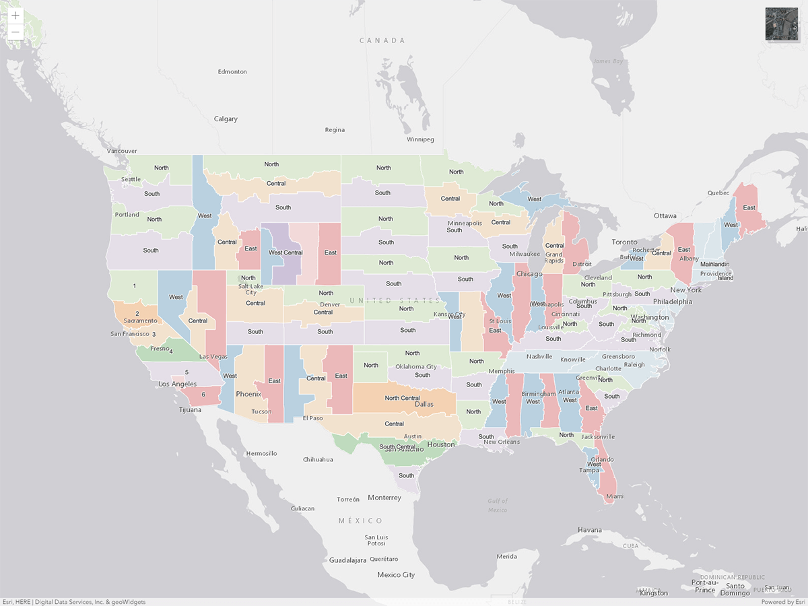

# Geodesy

## Contents
  - [Common Map Scales and Equivalents](#common-map-scales-and-equivalents)
  - [UTM Zones of the World](#utm-zones-of-the-world)
  - [US NAD 1983 State Plane Zones](#us-nad-1983-state-plane-zones)
  - [US NAD 1927 State Plane Zones](#us-nad-1927-state-plane-zones)

## Common Map Scales and Equivalents

| Map Scale | Architectual/ Engineering Scale | Visual Scale | Example map scale (areas to represent) |
| :---: | :---: | :---: | --- |
|          1:71 | 1 in ~ 6 ft 1 cm ~ 0.71 m       | Really?      | Web Map Zoom Level 23 |
|         1:141 | 1 in ~ 12 ft 1 cm ~ 1.41 m      |              | Web Map Zoom Level 22 |
|         1:282 | 1 in ~ 24 ft 1 cm ~ 2.82 m      | &uarr;       | Web Map Zoom Level 21 |
|         1:564 | 1 in = 47 ft 1 cm = 5.64 m      | Large Scale  | Web Map Zoom Level 20 (a mid-sized building) |
|       1:1,000 | 1 in ~ 83 ft 1 cm = 10 m        | &uarr;       |  |
|       1:1,128 | 1 in = 94 ft 1 cm ~ 11 m        |              | Web Map Zoom Level 19 (a road and crossing details) |
|       1:1,200 | 1 in = 100 ft 1 cm = 12 m       |              | US Site Plans & Plan and Profiles |
|       1:2,257 | 1 in ~ 188 ft 1 cm ~ 23 m       |              | Web Map Zoom Level 18 (a group of buildings) |
|       1:2,400 | 1 in = 200 ft 1 cm = 24 m       |              | Parcel Data |
|       1:4,514 | 1 in ~ 376 ft 1 cm ~ 45 m       |              | Web Map Zoom Level 17 (a block, park, or range of addresses) |
|       1:5,000 | 1 in ~ 417 ft 1 cm = 50 m       |              |  |
|       1:6,000 | 1 in = 500 ft 1 cm = 60 m       |              | Parcel Data |
|       1:9,028 | 1 in ~ 752 ft 1 cm ~ 90 m       |              | Web Map Zoom Level 16 (a street) |
|      1:10,000 | 1 in ~ 833 ft 1 cm = 100 m      | &darr;       |  |
|      1:12,000 | 1 in = 1,000 ft 1 cm = 120 m    | Large Scale  |  |
|      1:18,056 | 1 in ~ 1,505 ft 1 cm ~ 181 m    | &uarr;              | Web Map Zoom Level 15 (a rural road) |
|      1:24,000 | 1 in = 2,000 ft 1 cm = 240 m    |              | Used in USGS 7.5-minute topographic maps |
|      1:25,000 | 1 in ~ 2,083 ft 1 cm = 250 m    |              | Commonly used in many Canadian, European, US Military and USGS 7.5 x 15-minute topographic maps |
|      1:31,680 | 1 in = 0.5 mi 1 cm ~ 317 m      |              |  |
|      1:36,112 | 1 in ~ 0.57 mi 1 cm ~ 361 m     | &darr;       | Web Map Zoom Level 14 |
|      1:50,000 | 1 in ~ 0.79 mi 1 cm = 0.5 km    | Medium Scale | Commonly used in Canadian, European, US Military, and USGS County maps |
|      1:62,500 | 1 in ~ 0.99 mi 1 cm = 625 m     | &uarr;              | Used in USGS 15-minute topographic maps |
|      1:63,600 | 1 in = 1 mi 1 cm = 636 m        |              | Used in USGS 15-minnute Alaska series topographic maps |
|      1:72,224 | 1 in ~ 1.14 mi 1 cm ~ 722 m     |              | Web Map Zoom Level 13 (a village or suburb) |
|     1:100,000 | 1 in ~ 1.58 mi 1 cm = 1 km      |              | USGS & BLM 30 x 60-minute & USGS County maps |
|     1:144,448 | 1 in ~ 2.28 mi 1 cm = 1.44 km   | &darr;       | Web Map Zoom Level 12 (a town or city district) |
|     1:250,000 | 1 in ~ 3.95 mi 1 cm = 2.5 km    | Small Scale  | USGS 1 x 2-degree topographic maps |
|     1:288,895 | 1 in ~ 4.56 mi 1 cm ~ 2.89 km   | &uarr;       | Web Map Zoom Level 11 (a city) |
|     1:500,000 | 1 in ~ 7.89 mi 1 cm = 5 km      |              | USGS State Maps |
|     1:577,791 | 1 in ~ 9.12 mi 1 cm ~ 5.78 km   |              | Web Map Zoom Level 10 (a metropolitan area)|
|   1:1,000,000 | 1 in ~ 15.78 mi 1 cm = 10 km    |              | USGS State Maps |
|   1:1,155,581 | 1 in ~ 18.24 mi 1 cm ~ 11.56 km |              | Web Map Zoom Level 9 (a wide area or large metropolitan area) |
|   1:2,311,162 | 1 in ~ 36.48 mi 1 cm ~ 23.11 km |              | Web Map Zoom Level 8 |
|   1:4,622,325 | 1 in ~ 72.95 mi 1 cm ~ 46.22 km |              | Web Map Zoom Level 7 (a small country or US state) |
|   1:9,244,649 | 1 in ~ 146 mi 1 cm ~ 92 km      |              | Web Map Zoom Level 6 (a large European country)  |
|  1:18,489,298 | 1 in ~ 291 mi 1 cm ~ 185 km     |              | Web Map Zoom Level 5 (a large African country) |
|  1:36,978,597 | 1 in ~ 584 mi 1 cm ~ 370 km     |              | Web Map Zoom Level 4 (the United States) |
|  1:73,957,194 | 1 in ~ 1,167 mi 1 cm ~ 740 km   |              | Web Map Zoom Level 3 (the largest countries) |
| 1:147,914,388 | 1 in ~ 2,335 mi 1 cm ~ 1,479 km |              | Web Map Zoom Level 2 (a subcontinental area) |
| 1:295,828,755 | 1 in ~ 4,669 mi 1 cm ~ 2,958 km | &darr;       | Web Map Zoom Level 1 |
| 1:591,657,551 | 1 in ~ 9,338 mi 1 cm ~ 5,917 km | Small Scale  | Web Map Zoom Level 0 (the whole world)|  

Table of Contents: <a href="#contents">Section</a> | <a href="README.md#table-of-contents">Main</a>

## UTM Zones of the World

Click on the image to link to a basic map of all the UTM zones of the world. Each zone map tip includes a link to 
EPSG.io with filtered results to make finding EPSG/WKID codes easier.

Table of Contents: <a href="#contents">Section</a> | <a href="README.md#table-of-contents">Main</a>

## US NAD 1983 State Plane Zones

Click on the image to link to a basic map of all the NAD 1983 State Plane Zones in the United States. Each zone map tip 
includes a link to EPSG.io with filtered results to make finding associated EPSG/WKID codes easier.

Table of Contents: <a href="#contents">Section</a> | <a href="README.md#table-of-contents">Main</a>

## US NAD 1927 State Plane Zones

Click on the image to link to a basic map of all the NAD 1983 State Plane Zones in the United States. *NOTE: Only 
Hawaii and Michigan have registered EPSG codes. Links to EPSG.io have been disabled*

Table of Contents: <a href="#contents">Section</a> | <a href="README.md#table-of-contents">Main</a>
