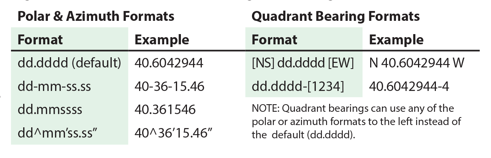

# Esri ArcMap and ArcGIS Pro

## Contents
  - [Common Data Types Supported by ArcGIS](#common-data-types-supported-by-arcgis)
  - [Precision versus Scale versus Length](#arcgis-precision-versus-scale-versus-length)
  - [ArcGIS Direction Systems and Units](#arcgis-direction-systems-and-units)

### Common Data Types Supported by ArcGIS

| Data Type | Range | Byte Size | Use |
| :---:     | :---: | :---:     | :--- |
| Short | &plusmn; 32,768 | 2 | To store integer values, typically used for coded values |
| Long | &plusmn; 2.1 billion | 4 | To store integer values, typically used to store quantity values |
| Float | -3.4 to 1.2 x 1038 | 4 | To store single precision (32 bit) floating point numbers, with a scale to 6 decimal places |
| Double | -2.2 to 1.8 x 10308 | 8 | To store double precision (64 bit) floating point numbers, with a scale greater than 6 decimal places |
| Date | varies | varies | To store dates | 
| Text | varies | 1 byte / character | To store character strings. Character encoding varies |
| GUID | n/a | 16 or 38 | To store a globally unique identifier |

Table of Contents: <a href="#contents">Section</a> | <a href="../README.md#table-of-contents">Main</a>

### ArcGIS Precision versus Scale versus Length

Table of Contents: <a href="#contents">Section</a> | <a href="../README.md#table-of-contents">Main</a>

### ArcGIS Direction Systems and Units

ArcGIS Pro and ArcMap support for direction systems for the constructions of features.

In **ArcMap**, to change the direction system and/or units, select **Options** from the **Editor Toolbar**, then 
select the **Units** tab. **ArcGIS Pro** integrates all four directions systems into its native editor by switching to
the abbreviations above.

The supported direction system units include the following: decimal degrees (*default*), degrees-minutes-seconds (DMS), 
radians, gradians, and gons.
    

Table of Contents: <a href="#contents">Section</a> | <a href="../README.md#table-of-contents">Main</a>

